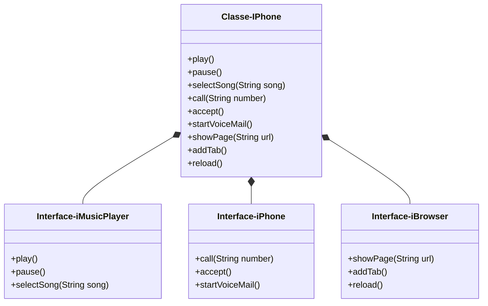

## Desafio 3 - IPhone com UML

### UML

```mermaid
classDiagram
    class Classe-IPhone {
        +play()
        +pause()
        +selectSong(String song)
        +call(String number)
        +accept()
        +startVoiceMail()
        +showPage(String url)
        +addTab()
        +reload()
    }
    
    class Interface-iMusicPlayer {
        +play()
        +pause()
        +selectSong(String song)
    }

    class Interface-iPhone {
        +call(String number)
        +accept()
        +startVoiceMail()
    }

    class Interface-iBrowser {
        +showPage(String url)
        +addTab()
        +reload()
    }

    Classe-IPhone *-- Interface-iMusicPlayer
    Classe-IPhone *-- Interface-iPhone
    Classe-IPhone *-- Interface-iBrowser
```